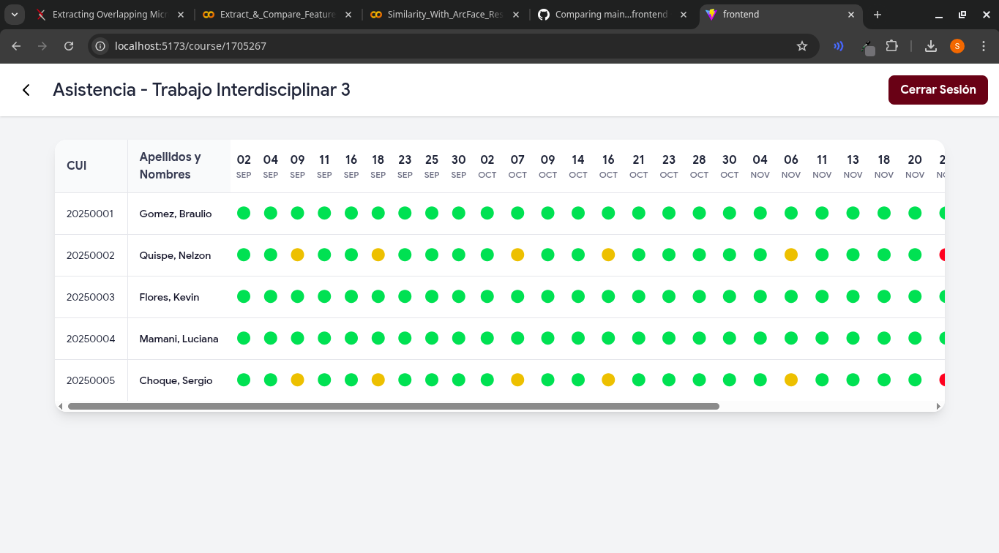

# DeepFaceAttend: Sistema de Control de Asistencia Basado en Reconocimiento Facial

Este repositorio contiene la investigación y el desarrollo del proyecto **DeepFaceAttend**, un sistema de control de asistencia basado en reconocimiento facial. El proyecto se encuentra **actualmente en desarrollo** y tiene como objetivo proponer una solución automatizada y precisa para la gestión de asistencia en entornos educativos, utilizando técnicas de aprendizaje profundo.

## Autores

Este proyecto es el resultado de una investigación en la Universidad Nacional de San Agustín.

- **Sergio Mogollon**
- **Paul Parizaca**
- **Braulio Maldonado**

---

## Tabla de Contenidos

- [Descripción del Proyecto](#descripción-del-proyecto)
- [Metodología: El Pipeline Propuesto](#metodología-el-pipeline-propuesto)
  - [Fase 0: Construcción del Dataset de Referencia](#fase-0-construcción-del-dataset-de-referencia)
  - [Fase 1: Preprocesamiento de Video en Tiempo Real](#fase-1-preprocesamiento-de-video-en-tiempo-real)
  - [Fase 2: Extracción de Características Faciales](#fase-2-extracción-de-características-faciales)
  - [Fase 3: Comparación y Verificación de Identidad](#fase-3-comparación-y-verificación-de-identidad)
  - [Fase 4: Registro de Asistencia y Enrolamiento de Nuevos Rostros](#fase-4-registro-de-asistencia-y-enrolamiento-de-nuevos-rostros)
- [Herramientas y Tecnologías](#herramientas-y-tecnologías)

---

## Descripción del Proyecto

Los sistemas tradicionales de control de asistencia son susceptibles a errores, ineficiencias y fraudes. Este proyecto propone un sistema automatizado que aprovecha los avances en visión por computadora para ofrecer una alternativa robusta y no intrusiva.

El enfoque se basa en **similaridad métrica**, utilizando el modelo **ArcFace** para convertir rostros en representaciones vectoriales de alta discriminación (*embeddings*). La identificación se realiza midiendo la similitud del coseno entre los *embeddings* capturados en tiempo real y los almacenados en una base de datos. Una ventaja fundamental de este método es que permite la incorporación de nuevos estudiantes sin necesidad de reentrenar el modelo, haciéndolo ideal para entornos dinámicos.

## Metodología: El Pipeline Propuesto

El sistema se estructura como un flujo de trabajo modular compuesto por cinco fases principales, tal como se ilustra en nuestro paper.

*Figura 1: Flujo de trabajo propuesto para el sistema DeepFaceAttend.*

### Fase 0: Construcción del Dataset de Referencia

Esta es la fase inicial de enrolamiento. El objetivo es crear una representación vectorial robusta para cada estudiante registrado.

1. **Recolección de Imágenes**: Se capturan varias fotografías de cada estudiante.
2. **Detección y Alineación**: Se utiliza el modelo **RetinaFace** para detectar el rostro en cada imagen y extraer 5 puntos clave faciales (*landmarks*). Estos puntos se usan para realizar una transformación afín que alinea el rostro (ojos horizontales, etc.).
3. **Extracción de Embeddings**: El rostro alineado y recortado (a 112x112 píxeles) se procesa con el modelo **ArcFace (iResNet50)** para generar un vector de características de 512 dimensiones.
4. **Almacenamiento**: Los embeddings generados, junto con los metadatos del estudiante, se guardan en archivos CSV para su posterior consulta.

### Fase 1: Preprocesamiento de Video en Tiempo Real

Esta fase prepara los fotogramas capturados desde una fuente de video para el reconocimiento.

1. **Captura de Fotogramas**: Se obtiene video en tiempo real desde una cámara.
2. **Detección de Rostros**: En cada fotograma, **RetinaFace** detecta todos los rostros presentes.
3. **Alineación**: Para cada rostro detectado, se realiza el mismo proceso de alineación que en la Fase 0 para asegurar la consistencia.

### Fase 2: Extracción de Características Faciales

Aquí, los rostros preprocesados en tiempo real se convierten en vectores.

1. **Generación de Embeddings**: Cada rostro alineado de la Fase 1 se pasa a través del modelo **ArcFace (iResNet50)** para generar su correspondiente embedding de 512 dimensiones.

### Fase 3: Comparación y Verificación de Identidad

Esta fase determina si un rostro capturado pertenece a un estudiante registrado.

1. **Cálculo de Similitud**: El embedding generado en la Fase 2 se compara con todos los embeddings almacenados en la base de datos de referencia (de la Fase 0).
2. **Métrica**: La comparación se realiza utilizando la **similitud del coseno**.
3. **Decisión**: Si la similitud con algún embedding de la base de datos supera un umbral predefinido, se considera una coincidencia y se identifica al estudiante.

### Fase 4: Registro de Asistencia y Enrolamiento de Nuevos Rostros

Esta es la etapa final donde se actualizan los registros.

1. **Asistencia de Estudiante Conocido**: Si se identifica un estudiante, el sistema marca su asistencia como "PRESENTE" en una base de datos **SQLite**, registrando la fecha y hora.
2. **Manejo de Rostro Desconocido**: Si un rostro no coincide con ningún registro, se activa un proceso de enrolamiento controlado. Se solicita al nuevo usuario que proporcione imágenes bajo condiciones estandarizadas para generar sus embeddings y agregarlos a la base de datos (Fase 0).

## Herramientas y Tecnologías

- **Lenguaje Base**: Python 3.11>
- **Framework de Deep Learning**: PyTorch
- **Visión por Computadora**: OpenCV
- **Modelo de Detección Facial**: RetinaFace
- **Modelo de Extracción de Embeddings**: ArcFace (con backbone iResNet50)
- **Base de Datos**: Archivos CSV (para embeddings) y SQLite (para registros de asistencia).

### Fase 5: Interfaz de Usuario
Se ha desarrollado una interfaz web utilizando React para facilitar la interacción con el sistema. La interfaz permite a los administradores gestionar estudiantes, ver registros de asistencia y monitorear el estado del sistema en tiempo real.

#### ***Diseño Móvil***

  

#### ***Diseño Escritorio***

 
 

### Funcionalidades en Modo Profesor

- Exportar registros de asistencia en formato PDF.

- Exportar registros de asistencia en formato CSV.

## Aplicacion

La aplicación se divide en 2 microservicios y un frontend:
- **Microservicio de Reconocimiento Facial (`face-recognition-mcsv`)**: Implementado en Python, este microservicio maneja la captura de video, procesamiento de imágenes, extracción de embeddings y verificación de identidad.
- **Microservicio de Gestión de Asistencia (`attendance-mcsv`)**: Implementado en Node.js con Express, este microservicio gestiona la base de datos SQLite, maneja las solicitudes de asistencia y proporciona una API RESTful para la comunicación con el frontend.
- **Frontend Web (`frontend`)**: Implementado en React, este componente proporciona una interfaz de usuario intuitiva para administradores y profesores, permitiéndoles gestionar estudiantes, ver registros de asistencia y monitorear el estado del sistema en tiempo real.